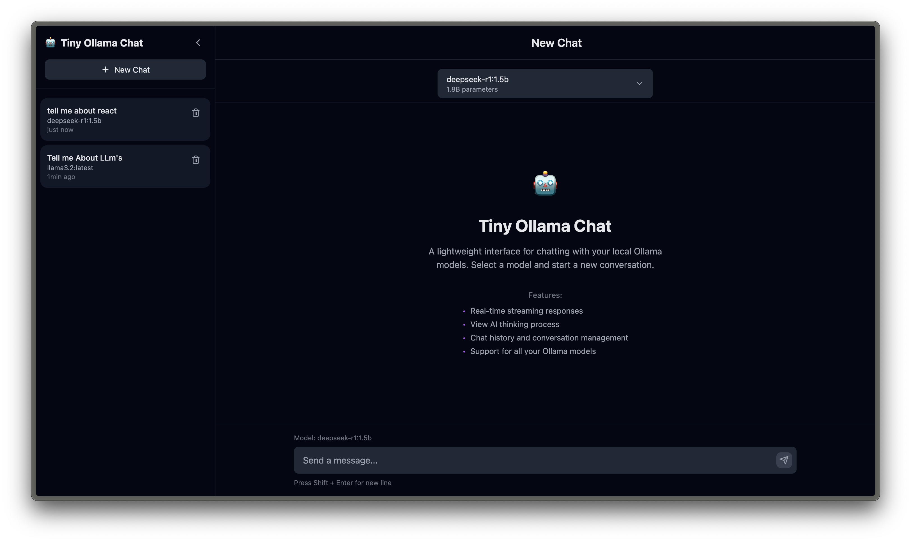
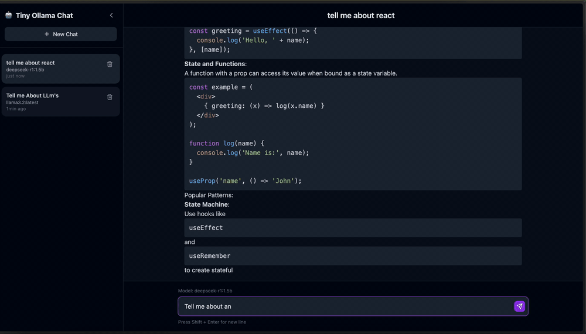

# 🤖 Tiny Ollama Chat

A lightweight and efficient UI for interacting with Ollama models locally. This application provides a simple yet powerful interface for chatting with AI models through Ollama.

## ✨ Features

- 📱 Real-time message streaming
- 🧠 View AI thinking process
- 💬 Conversation history
- 🚀 Multiple model support
- 🔗 Custom Ollama URL configuration
- 💾 Persistent storage with SQLite

## 📸 Screenshots & Demo





## 🚦 Prerequisites

- Ollama running locally or on a network-accessible machine
- Docker (for container method)
- Go and Node.js (for local build method)

## ⚙️ Ollama Configuration

By default, Ollama only listens on localhost (127.0.0.1), which makes it inaccessible from Docker containers. To allow connections from containers or other machines, you need to configure Ollama to listen on all interfaces:

```bash
OLLAMA_HOST=0.0.0.0:11434 ollama serve
```

or you can add this to your .bashrc or .zshrc file:

```bash
export OLLAMA_HOST=0.0.0.0:11434
```

This makes Ollama accessible from other machines and containers by binding to all network interfaces instead of just localhost.

## 🐳 Docker

### Option 1: Pull from GitHub Container Registry

The easiest way to get started is to pull the pre-built image from the GitHub Container Registry:

```bash
docker pull ghcr.io/anishgowda21/tiny-ollama-chat:latest
```

### Option 2: Build Docker Image Locally

Alternatively, you can build the Docker image locally:

```bash
docker build -t tiny-ollama-chat .
```

### Running the Docker Container

For both options, run the container with:

```bash
docker run -p 8080:8080 -v chat-data:/app/data tiny-ollama-chat
```

### Environment Variables

The Docker container supports configuration through environment variables:

- `PORT`: Server port (default: 8080)
- `OLLAMA_URL`: Ollama API URL (default: http://host.docker.internal:11434)
- `DB_PATH`: Database path (default: /app/data/chat.db)

Example with custom settings:

```bash
docker run -p 9000:9000 \
  -e PORT=9000 \
  -e OLLAMA_URL=http://host.docker.internal:11434 \
  -e DB_PATH=/app/data/custom.db \
  -v chat-data:/app/data \
  tiny-ollama-chat
```

### Connecting to Ollama

Options for connecting the Docker container to Ollama:

1. **Use the Docker host's IP address:**

   - On Linux: `-e OLLAMA_URL=http://172.17.0.1:11434` (Docker's default bridge gateway)
   - On macOS/Windows: `-e OLLAMA_URL=http://host.docker.internal:11434` (This is the default URL you don't need to pass this)

2. **Use the host network:**
   ```bash
   docker run --network=host tiny-ollama-chat
   ```

## 🏃‍♂️ Building Locally

If you prefer to build and run the application directly:

### Using the Build Script

The repository includes a build script that handles the entire build process:

```bash
# Make the script executable
chmod +x buildlocal.sh

# Run the build script
./buildlocal.sh
```

This script:

1. Creates a build directory
2. Builds the client with npm
3. Builds the server with Go
4. Places everything in the build directory

### Running the Application

After building:

```bash
cd build
./tiny-ollama-chat
```

### Command Line Options

The server supports several command line flags:

- `-port=8080`: Set the port for the server to listen on (default: 8080)
- `-ollama-url=http://localhost:11434`: Set the URL for the Ollama API (default: http://localhost:11434)
- `-db-path=chat.db`: Set the path to the SQLite database file (default: chat.db)

Example with custom settings:

```bash
./tiny-ollama-chat -port=9000 -ollama-url=http://192.168.1.100:11434 -db-path=/path/to/database.db
```

## 💡 Troubleshooting

### Ollama Connection Issues

If the application cannot connect to Ollama:

1. Verify Ollama is running: `ps aux | grep ollama`
2. Check that the Ollama URL is correct in your configuration
3. Ensure network connectivity between the container and Ollama
4. If using Docker, make sure you've configured Ollama to be accessible as described above

## 📖 Usage

1. Open the application in your browser
2. Select a model from the sidebar to start a new conversation
3. Type your message and press Enter or click the send button
4. Browse previous conversations in the sidebar
